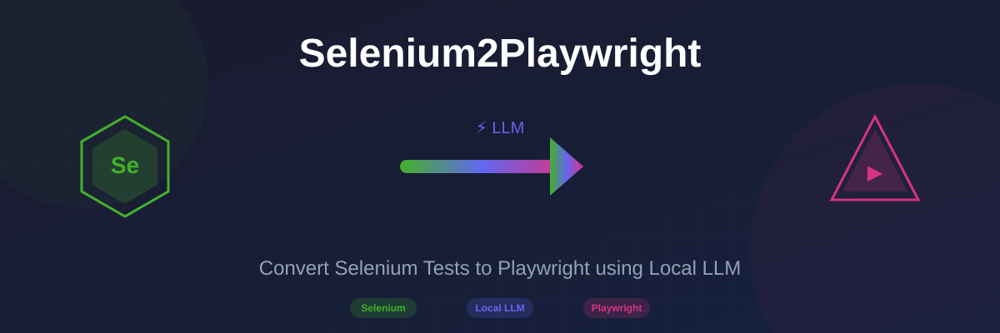

<div align="center">



# 🚀 Selenium2Playwright Converter

**Convert Selenium Python Tests to Playwright using Local LLM**

[](https://www.python.org/)
[](LICENSE)
[](https://playwright.dev/python/)
[](https://www.selenium.dev/)

**[Features](#features)** • **[Installation](#installation)** • **[Usage](#usage)** • **[Examples](#examples)** • **[Configuration](#configuration)**

</div>

---

## 📋 Table of Contents

- [Overview](#-overview)
- [Features](#-features)
- [Architecture](#-architecture)
- [Installation](#-installation)
- [Quick Start](#-quick-start)
- [Usage](#-usage)
- [Supported LLM Providers](#-supported-llm-providers)
- [Examples](#-examples)
- [Configuration](#-configuration)
- [Screenshots](#-screenshots)
- [Troubleshooting](#-troubleshooting)
- [Contributing](#-contributing)
- [License](#-license)

---

## 🌟 Overview

Selenium2Playwright is an intelligent code converter that transforms Selenium Python test scripts into Playwright Python code. It uses **Local LLMs** (Large Language Models) to understand complex code patterns and perform accurate conversions while preserving your test logic.

### Why Convert to Playwright?

| Feature | Selenium | Playwright |
|---------|----------|------------|
| Auto-wait | ❌ Manual | ✅ Built-in |
| Speed | 🐢 Slower | 🚀 Faster |
| Modern Web | ⚠️ Limited | ✅ Excellent |
| Debugging | Basic | Advanced |
| Browser Support | Good | Excellent |

---

## ✨ Features

### 🔥 Core Features

- **🤖 Local LLM Integration** - Uses Ollama, LM Studio, or Hugging Face models (no API keys needed!)
- **🔄 Batch Conversion** - Convert entire test directories in one command
- **📝 Smart Pattern Matching** - Regex + LLM for accurate conversions
- **⚡ Fast Processing** - Parallel conversion for multiple files
- **🎯 Preserves Logic** - Maintains test structure and assertions
- **🔍 Code Analysis** - Analyze complexity before conversion

### 🛡️ Supported Conversions

| Selenium Pattern | Playwright Equivalent |
|------------------|----------------------|
| `driver.get()` | `page.goto()` |
| `find_element(By.ID)` | `locator("#id")` |
| `find_element(By.CSS_SELECTOR)` | `locator("selector")` |
| `find_element(By.XPATH)` | `locator("xpath=...")` |
| `element.click()` | `element.click()` |
| `element.send_keys()` | `element.fill()` |
| `WebDriverWait` | `page.wait_for_selector()` |
| `time.sleep()` | `page.wait_for_timeout()` |
| `element.text` | `element.inner_text()` |
| `is_displayed()` | `is_visible()` |

---

## 🏗️ Architecture

```
┌─────────────────────────────────────────────────────────────┐
│                    Selenium2Playwright                       │
│                      Converter                               │
├─────────────────────────────────────────────────────────────┤
│                                                              │
│  ┌──────────────┐    ┌──────────────┐    ┌──────────────┐  │
│  │   Selenium   │───▶│  Code Parser │───▶│   Converter  │  │
│  │   Input File │    │   (AST/Regex)│    │   Engine     │  │
│  └──────────────┘    └──────────────┘    └──────┬───────┘  │
│                                                  │          │
│                         ┌───────────────────────┘          │
│                         ▼                                  │
│              ┌─────────────────────┐                       │
│              │   Local LLM Client  │                       │
│              │  ┌───────────────┐  │                       │
│              │  │   Ollama      │  │                       │
│              │  │   LM Studio   │  │                       │
│              │  │  HuggingFace  │  │                       │
│              │  └───────────────┘  │                       │
│              └──────────┬──────────┘                       │
│                         ▼                                  │
│              ┌─────────────────────┐                       │
│              │  Playwright Output  │                       │
│              └─────────────────────┘                       │
│                                                              │
└─────────────────────────────────────────────────────────────┘
```

---

## 📦 Installation

### Prerequisites

- Python 3.8 or higher
- One of the LLM providers installed (Ollama recommended)

### Step 1: Clone the Repository

```bash
git clone https://github.com/Qais7744/Selenium2PlaywrightConvertToLocalLLM.git
cd Selenium2PlaywrightConvertToLocalLLM
```

### Step 2: Install Dependencies

```bash
# Create virtual environment
python -m venv venv

# Activate virtual environment
# On Windows:
venv\Scripts\activate
# On macOS/Linux:
source venv/bin/activate

# Install dependencies
pip install -r requirements.txt
```

### Step 3: Install Ollama (Recommended)

```bash
# macOS/Linux
curl -fsSL https://ollama.com/install.sh | sh

# Windows - Download from https://ollama.com/download

# Pull a code model
ollama pull codellama
```

---

## 🚀 Quick Start

### 1️⃣ Convert a Single File

```bash
python -m src examples/selenium_sample.py -o output/
```

### 2️⃣ Convert Entire Directory

```bash
python -m src tests/selenium/ -o tests/playwright/
```

### 3️⃣ Analyze Before Converting

```bash
python -m src your_test.py --analyze
```

---

## 📖 Usage

### Command Line Interface

```bash
python -m src [OPTIONS] INPUT
```

### Options

| Option | Description | Default |
|--------|-------------|---------|
| `-o, --output` | Output file or directory | Auto-generated |
| `--llm` | LLM provider (ollama/lmstudio/huggingface) | ollama |
| `--model` | Model name | codellama |
| `--api-base` | Custom API base URL | None |
| `--no-llm` | Skip LLM enhancement | False |
| `--analyze` | Analyze code complexity | False |
| `--pattern` | File pattern for directories | *.py |
| `-v, --verbose` | Enable verbose output | False |

### Examples

```bash
# Use Ollama with codellama
python -m src input.py --llm ollama --model codellama

# Use LM Studio
python -m src input.py --llm lmstudio --api-base http://localhost:1234

# Batch convert with pattern
python -m src tests/ --pattern "test_*.py" -o converted/

# No LLM (regex only)
python -m src input.py --no-llm
```

### Python API

```python
from src import SeleniumToPlaywrightConverter

# Initialize converter
converter = SeleniumToPlaywrightConverter(
    llm_provider="ollama",
    model_name="codellama"
)

# Convert a file
converter.convert_file("selenium_test.py", "playwright_test.py")

# Convert directory
converter.convert_directory(
    "tests/selenium/",
    "tests/playwright/"
)

# Convert code string
selenium_code = """
from selenium import webdriver
driver = webdriver.Chrome()
driver.get("https://example.com")
"""

playwright_code = converter.convert_code(selenium_code)
print(playwright_code)
```

---

## 🤖 Supported LLM Providers

### Ollama (Recommended ⭐)

Free, local LLM runner. Perfect for code generation.

```bash
# Install: https://ollama.com
ollama pull codellama

# Usage
python -m src input.py --llm ollama --model codellama
```

**Recommended Models:**
- `codellama` - Code-optimized Llama model
- `codellama:13b` - Larger variant for complex code
- `mistral` - Fast and efficient
- `mixtral` - Mixture of experts model

### LM Studio

GUI for running local LLMs with OpenAI-compatible API.

```bash
# Download: https://lmstudio.ai
# Start local server in LM Studio

# Usage
python -m src input.py --llm lmstudio --api-base http://localhost:1234
```

### Hugging Face Transformers

Use Hugging Face models directly (requires more setup).

```bash
# Usage
python -m src input.py --llm huggingface --model microsoft/CodeGPT-small-py
```

---

## 📸 Screenshots

### Banner & Logo


### CLI Demo


### Conversion Example

**Before (Selenium):**
```python
from selenium import webdriver
from selenium.webdriver.common.by import By
from selenium.webdriver.support.ui import WebDriverWait
from selenium.webdriver.support import expected_conditions as EC

driver = webdriver.Chrome()
driver.get("https://example.com/login")

# Find and fill form
username = driver.find_element(By.ID, "username")
username.send_keys("testuser")

password = driver.find_element(By.ID, "password")
password.send_keys("password123")

# Submit
driver.find_element(By.CSS_SELECTOR, "button[type='submit']").click()

# Wait for redirect
WebDriverWait(driver, 10).until(
    EC.presence_of_element_located((By.CLASS_NAME, "dashboard"))
)

print(f"Current URL: {driver.current_url}")
driver.quit()
```

**After (Playwright):**
```python
from playwright.sync_api import sync_playwright

with sync_playwright() as p:
    browser = p.chromium.launch(headless=False)
    context = browser.new_context()
    page = context.new_page()
    
    page.goto("https://example.com/login")
    
    # Fill form
    page.locator("#username").fill("testuser")
    page.locator("#password").fill("password123")
    
    # Submit
    page.locator("button[type='submit']").click()
    
    # Wait for redirect
    page.wait_for_selector(".dashboard", timeout=10000)
    
    print(f"Current URL: {page.url}")
    
    context.close()
    browser.close()
```

---

## 🔧 Configuration

### Config File

Create a `config.yaml` file for persistent settings:

```yaml
llm:
  provider: ollama
  model: codellama
  temperature: 0.1
  max_tokens: 4096

conversion:
  preserve_structure: true
  add_comments: true
  use_async: false
```

### Environment Variables

```bash
export S2P_LLM_PROVIDER=ollama
export S2P_MODEL_NAME=codellama
export S2P_API_BASE=http://localhost:11434
```

---

## 🧪 Examples

Check the `examples/` directory for sample conversions:

- `selenium_sample.py` - Original Selenium test
- `playwright_converted.py` - Converted Playwright test

### Running Examples

```bash
# Analyze the sample
python -m src examples/selenium_sample.py --analyze

# Convert the sample
python -m src examples/selenium_sample.py -o examples/

# Compare results
diff examples/selenium_sample.py examples/selenium_sample_playwright.py
```

---

## 🛠️ Troubleshooting

### Common Issues

#### Ollama Connection Error
```
Error: Could not connect to Ollama at http://localhost:11434
```
**Solution:** Make sure Ollama is running:
```bash
ollama serve
```

#### Model Not Found
```
Error: model 'codellama' not found
```
**Solution:** Pull the model first:
```bash
ollama pull codellama
```

#### Python Import Errors
```
ModuleNotFoundError: No module named 'playwright'
```
**Solution:** Install dependencies:
```bash
pip install -r requirements.txt
playwright install
```

### Getting Help

- 📖 [Documentation](https://github.com/Qais7744/Selenium2PlaywrightConvertToLocalLLM#readme)
- 🐛 [Issue Tracker](https://github.com/Qais7744/Selenium2PlaywrightConvertToLocalLLM/issues)
- 💬 [Discussions](https://github.com/Qais7744/Selenium2PlaywrightConvertToLocalLLM/discussions)

---

## 🤝 Contributing

Contributions are welcome! Please follow these steps:

1. **Fork** the repository
2. **Create** a feature branch (`git checkout -b feature/amazing-feature`)
3. **Commit** your changes (`git commit -m 'Add amazing feature'`)
4. **Push** to the branch (`git push origin feature/amazing-feature`)
5. **Open** a Pull Request

### Development Setup

```bash
# Clone your fork
git clone https://github.com/YOUR_USERNAME/Selenium2PlaywrightConvertToLocalLLM.git

# Install dev dependencies
pip install -r requirements.txt
pip install pytest black isort

# Run tests
pytest tests/

# Format code
black src/
isort src/
```

---

## 📊 Project Statistics


---

## 📝 License

This project is licensed under the **MIT License** - see the [LICENSE](LICENSE) file for details.

---

## 🙏 Acknowledgments

- [Playwright](https://playwright.dev/) - Modern web testing framework
- [Selenium](https://www.selenium.dev/) - Classic web testing framework
- [Ollama](https://ollama.com/) - Local LLM runner
- [CodeLlama](https://github.com/facebookresearch/codellama) - Code generation model

---

## 📞 Contact

**Qais7744**

- GitHub: [@Qais7744](https://github.com/Qais7744)
- Project: [Selenium2Playwright](https://github.com/Qais7744/Selenium2PlaywrightConvertToLocalLLM)

---

<div align="center">

**⭐ Star this repository if you find it helpful! ⭐**

Made with ❤️ and 🤖 Local LLMs

</div>
